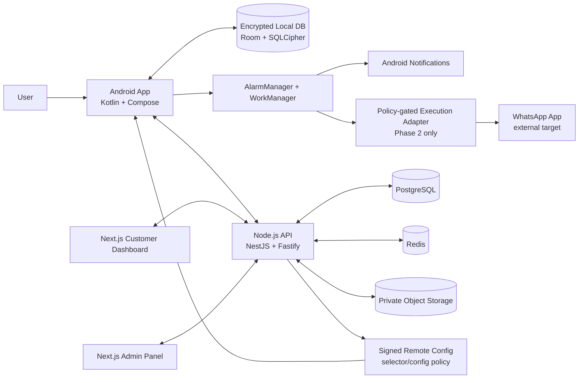
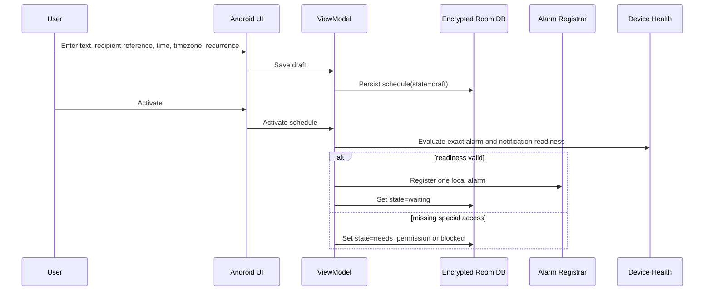

# Seduligma System Architecture

**Status:** Canonical engineering design.  
**Authority:** PRD v2.1 governs when this document is silent or conflicts with it.  
**Decision made here, not in PRD:** The commercial backend is a modular NestJS/Fastify service with PostgreSQL and Redis; it is not a prerequisite for Phase 2 local personal automation.

## 1. Architectural Invariants

The Android device is the execution source of truth for a local schedule. The backend does not trigger, dispatch, or impersonate a personal message send. The Android client may perform a policy-gated, user-authorised personal workflow only in Phase 2, after its declared distribution, disclosure, consent, supported-device, and test gates pass.

The implementation must retain the PRD state machine, must use truthful local evidence, and must not make delivery/read/enforcement claims. AccessibilityService use, where later approved, is limited to a narrow, static, human-defined execution script; it does not permit autonomous AI decisions.[1]

## 2. Component Model



| Component | Owns | Explicitly does **not** do |
|---|---|---|
| Android app | Local schedule lifecycle, encrypted local data, alarm registration, readiness checks, local evidence/status, consent UX | It does not claim delivered/read status or silently request special access. |
| Phase 2 execution adapter | Verified static workflow only after consent/policy gates; failure classification | It does not use blind coordinates, credentials, AI decisions, or remote commands to send. |
| Node.js API | Identity, devices, subscriptions, consented sync, support telemetry, signed config, admin audit | It does not trigger a personal message or become a second scheduler source of truth. |
| PostgreSQL | Durable commercial/account metadata and consented server records | It does not store raw message/contact content by default. |
| Redis | Rate-limited backend jobs, cache, webhook handling, short-lived coordination | It does not queue personal message sends. |
| Object storage | User-consented attachments, signed config artifacts, export archives | It does not hold Android lock credentials or unrestricted diagnostics. |
| Customer dashboard | Account, device, subscription, consented schedule view/edit queue | It does not execute a send; device acknowledgement is required. |
| Admin panel | Support, audit, consent-aware diagnostics, signed config release workflow | It does not reveal raw customer content without explicit permission and role justification. |

## 3. Technology Decisions

| Layer | Choice | Decision rationale |
|---|---|---|
| Android | Kotlin, Jetpack Compose, Hilt | Native Android APIs, modern declarative UI, testable dependency injection. |
| Local persistence | Room + SQLCipher + Android Keystore-backed passphrase | Offline-first scheduling and encrypted local content. |
| Time execution | AlarmManager for exact user-visible alarms; WorkManager for non-exact recovery/sync | Android distinguishes exact alarm access from deferrable background work.[2] |
| API | Node.js TypeScript, NestJS, Fastify | Modular server, typed services, validation, OpenAPI support, fast HTTP runtime. |
| Server database | PostgreSQL 16+ | Strong transactions, relational integrity, row-level ownership queries, JSONB only where flexibility is required. |
| Server cache/queue | Redis + BullMQ | Reliable backend-only jobs, retry policy, webhook processing; never personal dispatch. |
| Web | Next.js + TypeScript + Tailwind CSS | Maintainable customer/admin interfaces with server-side protected routes. |
| Auth | Standards-based OIDC/OAuth 2.1 provider plus JWT validation | Provider-neutral, mobile and web compatible authentication. |
| Observability | Sentry-compatible error tracking, structured logs, metrics | Fast diagnosis without collecting raw content by default. |

### 3.1 Confirmed Single-Monorepo Convention

**Founder decision:** This repository is the sole Seduligma codebase. Android, backend, web, documentation, and CI configuration live together; no separate Android or platform repository is assumed.

```text
Scheduling-app/
├── app/                 # Kotlin/Compose Android client; active Phase 0–3 work
├── backend/             # Node.js API; reserved until Phase 4 approval
├── web/                 # Next.js customer/admin dashboard; reserved until Phase 4 approval
├── docs/                # Canonical PRD and engineering suite
├── .github/workflows/   # Component-aware CI definitions
└── AGENTS.md            # Agent governance entry point
```

`backend/` and `web/` are repository boundaries, not permission to scaffold or implement commercial functionality early. Until the PRD Phase 4 trigger is approved, an agent may edit only approved documentation/placeholders in those folders and must not create authentication, database, billing, dispatch, dashboard, or production API functionality.

## 4. Primary Data Flows

### 4.1 Local Schedule Creation



### 4.2 Due Schedule and Terminal State

At due time, the receiver re-checks schedule existence, timezone/recurrence, exact-alarm access, notification readiness, and device state. Tier A posts an explicit action notification and waits for the user. Tier B/C reflect a user-managed device state. Tier D is disabled unless its separate gate is approved. Phase 2 execution first attempts the verified prefilled-chat route; if the expected target state cannot be proven, the workflow aborts as `failed` or `uncertain`. It never uses blind coordinate tapping.

### 4.3 Consented Account Sync

The client writes a local outbox record after a syncable change. A background sync worker authenticates with OIDC, sends a versioned delta, receives an acknowledgement, and marks the outbox item complete. Server conflict resolution never changes an active local alarm without a version check and a device acknowledgement. Raw message body and contact content are excluded unless the user has opted into a named sync purpose.

### 4.4 Signed Remote Configuration

An admin prepares a signed, versioned, scoped, expiry-bearing configuration package. A second authorised reviewer approves it. The API publishes only the approved release. The Android client verifies signature, audience, app version, supported device scope, and expiry before storing it. A failure leaves the previous known-good configuration active; a server-side kill switch can disable the affected feature.

## 5. Trust Boundaries

| Boundary | Data allowed to cross | Prohibited/default-local data | Control |
|---|---|---|---|
| User → Android app | User-entered schedule content and recipient reference | Device PIN, OTP, biometrics | Explicit UI, local encryption. |
| Android app → external target app | Only user-authorised local intent/workflow parameters | Logs, diagnostics, unrelated schedules | State verification and safe abort. |
| Android app → backend | Device ID, app version, consent flags, health summary, redacted event codes; optional explicitly consented sync | Raw body/contact content, lock credentials, screen captures by default | OIDC, TLS, schema validation, consent proof. |
| Admin → remote config | Signed selector/config artifact and release metadata | Arbitrary unsigned executable instructions | Dual review, signing, expiry, audit, kill switch. |
| Web/admin → API | Authenticated business requests | Direct device-control or send-command endpoint | Role checks, audit log, no dispatch capability. |

## References

[1]: https://support.google.com/googleplay/android-developer/answer/10964491?hl=en-GB "Google Play — Use of the AccessibilityService API"  
[2]: https://developer.android.com/develop/background-work/services/alarms "Android Developers — Schedule alarms"
