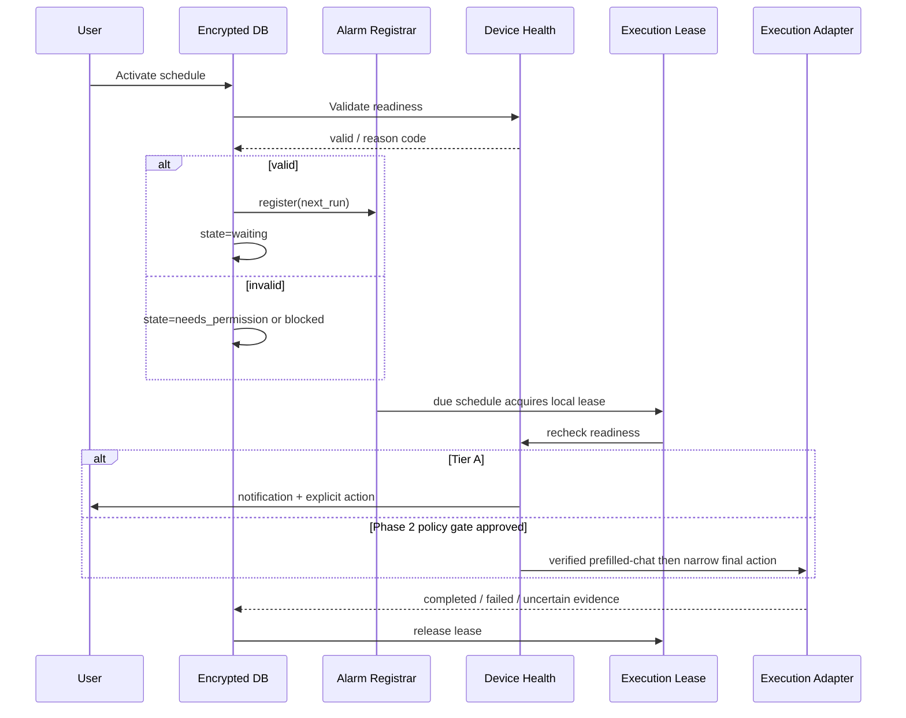

# Seduligma Detailed System Design

**Status:** Canonical technical behaviour.  
**Decision made here, not in PRD:** All timestamps are UTC epoch milliseconds in storage/API; IANA timezone IDs are stored separately for recurrence interpretation.

## 1. State Machine and Transition Rules

| State | Valid transitions | Trigger and guard | Invalid transition handling |
|---|---|---|---|
| `draft` | `needs_permission`, `waiting`, `blocked`, `cancelled` | User activates; readiness evaluates | Reject with `INVALID_STATE_TRANSITION`. |
| `needs_permission` | `draft`, `waiting`, `blocked`, `cancelled` | User returns from settings; readiness rechecked | Never auto-grant or register an exact alarm. |
| `waiting` | `attempting`, `paused`, `cancelled`, `needs_permission`, `blocked`, `uncertain` | Alarm fires, user pauses/cancels, special access revoked, boot reconciliation | Alarm operation checks optimistic version. |
| `blocked` | `draft`, `needs_permission`, `waiting`, `cancelled` | User changes preconditions and reactivates | Must retain precise blocker code. |
| `attempting` | `completed`, `failed`, `uncertain`, `waiting` | Local evidence produces outcome; recurrence computes next occurrence | No second attempt may run concurrently. |
| `completed` | `waiting` for valid recurrence only | Recurrence next occurrence exists | One-time completion is terminal. |
| `failed` | `draft`, `waiting`, `cancelled` | User edits/retries after inspection | Retry requires explicit policy and latest readiness. |
| `uncertain` | `draft`, `waiting`, `cancelled` | User reviews/retries or recurrence is restored | Never auto-convert to completed. |
| `paused` | `draft`, `waiting`, `cancelled` | User reactivates or edits | Alarm must be absent. |
| `cancelled` | none | User cancellation | Immutable terminal audit record. |

## 2. Error Taxonomy

| Code | State outcome | User-facing message | Retry mode |
|---|---|---|---|
| `EXACT_ALARM_DENIED` | `needs_permission` | “Exact alarm access is needed for precise timing.” | User opens settings then reactivates. |
| `NOTIFICATION_DENIED` | `needs_permission` | “Notifications are off; you may miss scheduled actions.” | User opens settings. |
| `DEVICE_LOCKED_NO_TIER` | `blocked` | “Unlock the phone or use Ask Me Before Sending.” | Manual user action. |
| `TARGET_APP_MISSING` | `blocked` | “The selected target app is unavailable.” | Reinstall/select supported target. |
| `TARGET_UI_NOT_FOUND` | `failed` | “Expected screen was not found. Nothing was sent.” | No blind retry; review/update. |
| `PREFILL_INTENT_FAILED` | `failed` | “The prepared chat could not be opened.” | User retries after checking app state. |
| `USER_CANCELLED_CONFIRMATION` | `paused` | “Schedule action was cancelled.” | User reactivates. |
| `ALARM_MISSED_AFTER_REBOOT` | `uncertain` | “The phone restarted around this schedule. Review required.” | User reviews/retries. |
| `CONCURRENT_EXECUTION_BLOCKED` | `waiting` | “Another scheduled action is in progress.” | Queue remains in single lane. |
| `NETWORK_UNAVAILABLE` | `blocked` or `uncertain` | “Network state prevented this action.” | User/device-dependent. |
| `REMOTE_CONFIG_INVALID` | `blocked` | “Configuration verification failed; this feature is disabled.” | Admin remediation; no client bypass. |

## 3. Single Local Execution Lane

One `ExecutionLease` row exists in the encrypted local database. A due worker must atomically acquire it with a monotonic lease token and expiry. If held by another non-expired attempt, the schedule remains `waiting` and records `CONCURRENT_EXECUTION_BLOCKED`; it does not run in parallel. The process releases the lease in a `finally` path. Boot recovery clears only expired leases and marks the interrupted attempt `uncertain`.

## 4. Local Room/SQLCipher Schema

| Table | Primary key | Key fields | Indexes / constraints |
|---|---|---|---|
| `schedule` | `id UUID/text` | title, message_preview, recipient_ref, next_run_at_utc, timezone_id, recurrence_rule, state, state_version, created_at, updated_at | `idx_schedule_state_next_run(state,next_run_at_utc)`, timezone non-empty. |
| `schedule_event` | `id` | schedule_id FK, event_type, reason_code, occurred_at, redacted_metadata_json | `idx_event_schedule_time(schedule_id,occurred_at)`. |
| `execution_lease` | constant `local-lane` | token, schedule_id, acquired_at, expires_at | Exactly one row. |
| `sync_outbox` | `id` | aggregate_type, aggregate_id, operation, version, payload_class, created_at, attempt_count | Unique `(aggregate_id,version,operation)`. |
| `device_settings_snapshot` | `id` | exact_alarm_allowed, notifications_allowed, app_version, captured_at | Latest only; redacted. |
| `consent_receipt` | `id` | purpose, policy_version, granted_at, revoked_at | Unique active consent per purpose. |
| `remote_config_cache` | `config_id` | version, signature, issued_at, expires_at, payload, verified_at | Reject expired/invalid config. |

No local table stores device PIN/password, OTP, biometric template, third-party app credential, or raw screenshot. Tier D has no schema until the separate human-approved threat-model gate is complete.

## 5. Backend PostgreSQL Schema

| Table | Primary key | Core fields | Notes |
|---|---|---|---|
| `users` | UUID | oidc_subject unique, email, display_name, created_at | Identity only. |
| `organizations` | UUID | name, status, created_at | Enables later agency/business plans. |
| `organization_members` | composite | organization_id, user_id, role | `owner`, `admin`, `member`, `support_viewer`. |
| `devices` | UUID | user_id, public_key, platform, app_version, last_seen_at, status | No device secret/plain content. |
| `device_consents` | UUID | device_id, purpose, policy_version, granted_at, revoked_at | Immutable grant/revoke events. |
| `schedule_sync_metadata` | UUID | device_id, local_schedule_id, version, state, next_run_at, body_sync_consent | Excludes content by default. |
| `subscriptions` | UUID | organization_id/user_id, provider_customer_id, provider_subscription_id, plan_code | Store provider IDs only; fetch payment facts from provider. |
| `usage_counters` | composite | scope_id, period_start, metric, value | Billing entitlement calculation. |
| `remote_configs` | UUID | version, audience, payload_hash, signature, expires_at, status | `draft`, `approved`, `released`, `revoked`. |
| `remote_config_approvals` | UUID | config_id, approver_user_id, decision, timestamp | Two-person approval where production policy requires it. |
| `audit_logs` | UUID | actor, action, resource_type/id, ip_hash, timestamp, metadata | Immutable, redacted audit. |
| `support_cases` | UUID | requester, device_id, consent_scope, status | Does not make content visible without consent. |

## 6. Sequence: Local Schedule Through Terminal Outcome



## 7. Decision Register

| ID | Decision | Made by | Rationale |
|---|---|---|---|
| SD-01 | Use REST + OpenAPI rather than GraphQL. | This document | Mobile/offline clients benefit from explicit versioned request contracts and conventional tooling. |
| SD-02 | Use UUID identifiers across backend; text UUID locally. | This document | Offline generation and sync without ID collision. |
| SD-03 | Backend accepts sync metadata by default, not raw schedule content. | PRD v2.1 principle implemented here | Privacy-by-default and local execution source of truth. |
| SD-04 | Separate execution lease from schedule record. | This document | Enables atomic single-lane enforcement and reboot recovery. |

## 8. Uniform Multi-Channel Execution Design

**Decision made here, not in PRD:** Every planned personal-messaging channel uses the same local, policy-gated Accessibility execution architecture. The supported channel set is `WHATSAPP`, `TELEGRAM`, `MESSENGER`, `SMS_APP`, and `EMAIL_APP`. This is one mechanism with channel profiles, not five independent native/API integration paths.

```kotlin
interface ExecutionAdapter {
    val channel: Channel
    fun evaluateReadiness(schedule: Schedule, profile: ChannelProfile): ReadinessResult
    suspend fun prepare(schedule: Schedule, profile: ChannelProfile): PrepareResult
    suspend fun executeVerifiedFinalAction(
        schedule: Schedule,
        profile: ChannelProfile,
        lease: ExecutionLease,
    ): ExecutionResult
    fun cancelOrAbort(reason: ScheduleReasonCode)
}
```

| Adapter | Target application examples | Common execution rules |
|---|---|---|
| `WhatsAppAdapter` | WhatsApp, WhatsApp Business where separately profiled | Verified prefilled-chat route where available, then static final-action flow. |
| `TelegramAdapter` | Telegram app | Same readiness, selector verification, single lane, safe abort, and local-evidence rules. |
| `MessengerAdapter` | Facebook Messenger | Same readiness, selector verification, single lane, safe abort, and local-evidence rules. |
| `SmsAppAdapter` | Google Messages, Samsung Messages, other separately profiled apps | UI automation only; no `SmsManager` send path in this product design. |
| `EmailAppAdapter` | Gmail, Outlook, other separately profiled apps | UI automation only; no Gmail OAuth/direct-send path in this product design. |

`ChannelProfile` is a signed, versioned, audience-scoped remote configuration record. It identifies the target package, known compatible app/version family, required device/app state, safe intent/preparation capability, selector identifiers, expiry, and rollback/kill-switch scope. It is not an arbitrary script runner and cannot introduce unreviewed actions.

Each channel profile follows the identical Phase 2 gate: distribution decision, Accessibility declaration, prominent disclosure, affirmative consent, no-blind-action validation, signed configuration, supported-device/app matrix, kill switch, and controlled beta evidence. A channel may be absent or disabled until its individual profile has passed those gates; uniform architecture does not imply simultaneous release of every target application.

`TELEGRAM_BOT_API` is a documented future alternative for a founder-approved lower-risk Telegram route. It is not the default product path, is not substituted silently for `TelegramAdapter`, and requires a separately approved API/content/data contract if selected.

All adapters share the same state machine and error taxonomy. None may report delivery, read, or recipient consumption based on UI automation. Valid outcomes remain local evidence only: prepared, final action verified, failed, or uncertain.

Add the following channel-neutral error codes: `CHANNEL_PROFILE_UNAVAILABLE`, `CHANNEL_APP_UNSUPPORTED`, `CHANNEL_APP_VERSION_UNTESTED`, `CHANNEL_SELECTOR_MISMATCH`, `CHANNEL_COMPOSE_UI_NOT_READY`, and `CHANNEL_FINAL_ACTION_UNVERIFIED`. Their terminal state is `blocked`, `failed`, or `uncertain` according to the existing transition table; no adapter may invent a success result.
